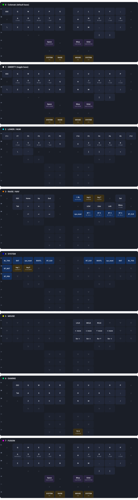
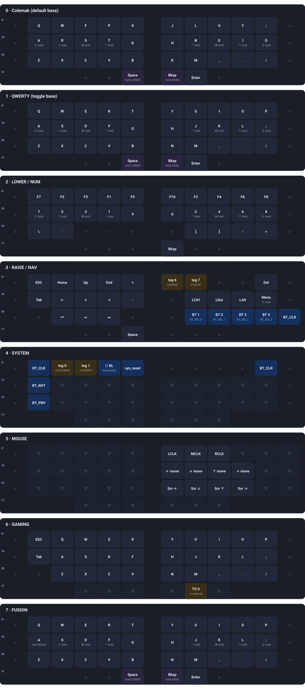
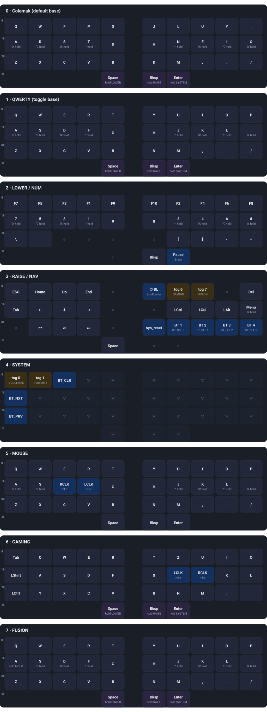

# zmk-config (unified)

Unified ZMK config for **3 keyboards × 2 base layouts** — Hatsu / Corneish Zen v2 / Tractyl (nice_nano + tracktyl shields). Targets **upstream ZMK main** (Zephyr 4.1) with shared QWERTY/Colemak.

## Boards

| Board | Build target | Keymap | Conf |
|-------|--------------|--------|------|
| Hatsu | `hatsu_left//zmk`, `hatsu_right//zmk` | `config/hatsu_left.keymap` (symlink `hatsu_right`) | `hatsu_left.conf` / `hatsu_right.conf` |
| Zen v2 | `corneish_zen_left//zmk`, `corneish_zen_right//zmk` | `config/corneish_zen.keymap` | `corneish_zen.conf` |
| Tractyl | `nice_nano//zmk + tracktyl_left/right` | `config/tracktyl.keymap` (symlinks) | `tracktyl*.conf` + `config/boards/shields/tracktyl/` |

## Shared layouts

- `config/layouts/alphas.h` — QWERTY vs Colemak (plain) per-row macros (`QW_R*`, `CM_R*`). Geometries differ so only letters are shared, not full `bindings` vectors.
- `config/behaviors/homerow.dtsi` — single `bhm` 200 ms balanced hold-tap (included via `#include`).
- `config/west.yml` — `zmk@main` + `zmk-pmw3610-driver@main` for Tractyl trackball.

Base layers (default Colemak, runtime toggle, not separate UF2s):
- `0 BASE_COLEMAK` (plain: `Q W F P G / A R S T D`), `1 BASE_QWERTY`, `2 LOWER/NUM`, `3 RAISE/NAV`, `4 SYSTEM`, `5 MOUSE`, `6 GAMING`, `7 FUSION`
- Flip QWERTY↔Colemak live via outer `Q+P` chord (`&tog` flip-flop) or **SYSTEM layer** `&tog` keys; reboot always returns to Colemak (runtime-only, nothing persisted). Hatsu shows white while on QWERTY.

Other shared: `NUM` F-keys/numbers, `NAV` arrows/media, `SYSTEM` BT, `MOUSE` `&mkp/&mmv/&msc`. Tractyl retains `trackball_listener` + combos; Hatsu retains `bat`/`bootl`/`lc` layer-color relay.

## Keymap overview

> Interactive version (rendered HTML): [`keymap_overview.html`](https://b4nn4n4.github.io/zmk-config/keymap_overview.html) via GitHub Pages.
> GitHub strips `<script>`/`<style>` from READMEs, so the layer graphics below are embedded SVGs generated from the same data (thumb clusters sit under their respective half).
> Legend: `·` = no key, `▽` = transparent (fall through to lower layer), `KEY (hold)` = tap KEY / hold MOD or layer, `mo` / `tog` / `TO` = momentary / toggle / jump-to layer.

<!-- KEYMAP-OVERVIEW-START -->

### Hatsu · 52 keys
Source: `config/hatsu_left.keymap (symlinked as hatsu_right.keymap) · 52 keys (pos 0–51) · 8 layers · 4 combos`

**Combos (Hatsu · 52 keys)** — all 50 ms timeout

| Name | Keys (pos) | Output | Note |
|---|---|---|---|
| `combo_esc` | 0 + 1 | `ESC` | top-left two keys |
| `combo_base_flip` | 1 + 10 | `&tog BASE_QWERTY (flip-flop)` | Q + ; — toggles Colemak ↔ QWERTY |
| `combo_bootload` | 44 + 47 | `&bootl (UF2)` | hidden thumb chord (both ∅ on base layers) |
| `combo_sysreset` | 45 + 46 | `&sys_reset` | hidden thumb chord (both ∅ on base layers) |

### Corneish Zen · 42 keys
Source: `config/corneish_zen.keymap · 42 keys (pos 0–41: 3×12 + 6 thumbs) · 8 layers · 4 combos`

**Combos (Corneish Zen · 42 keys)** — all 50 ms timeout

| Name | Keys (pos) | Output | Note |
|---|---|---|---|
| `combo_esc` | 1 + 2 | `ESC` | Q + W |
| `combo_base_flip` | 1 + 10 | `&tog BASE_QWERTY (flip-flop)` | Q + ; — toggles Colemak ↔ QWERTY |
| `combo_bootload` | 0 + 11 | `&bootloader` | outer top-row ∅ pair |
| `combo_sysreset` | 12 + 23 | `&sys_reset` | outer homerow ∅ pair |

### Tractyl · 33 keys
Source: `config/tracktyl.keymap + shields/tracktyl/tracktyl.dtsi transform (3×10 + 3 thumbs) · 33 keys (pos 0–32) · 8 layers · 6 combos`

**Combos (Tractyl · 33 keys)** — all 50 ms timeout

| Name | Keys (pos) | Output | Note |
|---|---|---|---|
| `combo_esc` | 0 + 1 | `ESC` | Q + W |
| `combo_middleclick` | 12 + 13 | `&mlt 2 MCLK (tap MCLK / hold MOUSE)` | homerow S+T position pair |
| `combo_middlepress` | 16 + 17 | `&mkp MCLK` | N+E position pair |
| `combo_bootload` | 0 + 30 | `&bootloader` | Q + LOWER/Space thumb |
| `combo_sysreset` | 0 + 24 | `&sys_reset` | Q + B |
| `combo_base_flip` | 0 + 9 | `&tog BASE_QWERTY (flip-flop)` | Q + ; — toggles Colemak ↔ QWERTY |

<!-- KEYMAP-OVERVIEW-END -->

## Build pipelines (4 workflows)

- `build-hatsu.yml` → `build-hatsu.yaml` — triggers on `config/hatsu*`, `boards/**`, `dts/**`, `drivers/**`, `src/**`
- `build-zen.yml` → `build-zen.yaml` — triggers on `config/corneish_zen.*`
- `build-tractyl.yml` → `build-tractyl.yaml` — triggers on `config/tracktyl*`, `config/boards/shields/tracktyl/**`
- `build-all.yml` → `build.yaml` (all boards + `settings_reset`) — **unified trigger** for central changes: `config/layouts/**`, `config/behaviors/**`, `config/west.yml`, `build*.yaml`, `.github/workflows/**`

Each uses `zmkfirmware/zmk/.github/workflows/build-user-config.yml@main` with `build_matrix_path` + `config_path: config`. `workflow_dispatch` available.

Local history from `zmk-config-hatsu` (MiaoBreak credits), `zmk-config-zen-2`, `zmk-config-tractyl` merged.

## Credits

Hatsu: [MiaoBreak](https://github.com/hlord2000/MiaoBreak) (hlord2000 / ashleymcdonald) — AW20216S, CW2015, bootloader. See `bootloader/` and `AGENTS.md` gotchas (≤8 char behavior names, `GPREGRET 0x57`, `CONFIG_SETTINGS` both halves, `zmk,physical-layout`).

Zen: Corneish Zen v2 low-profile.

Tractyl: [badjeff pmw3610](https://github.com/badjeff).

## Flashing

- Hatsu: hold **SYSTEM + E (left) / I (right)** → `AM_HATSU` drive → copy UF2. `settings_reset` UF2 wipes bonds if pairing stuck.
- Zen/Tractyl: double-tap reset → copy UF2 (see upstream docs).
- If `CI` fails: `gh run view <id> --log-failed | grep -i error`.
